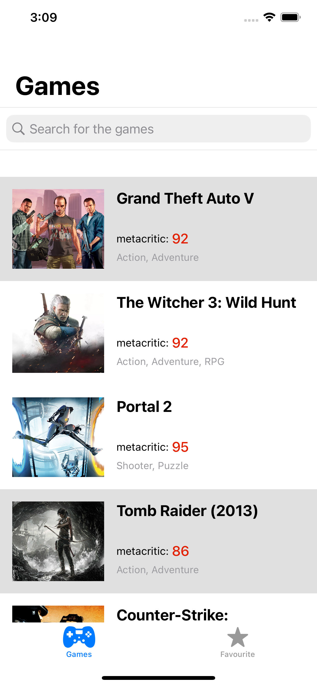
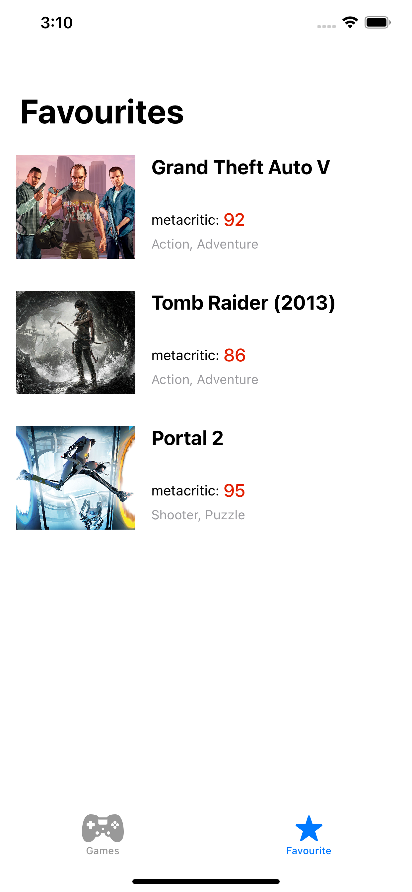
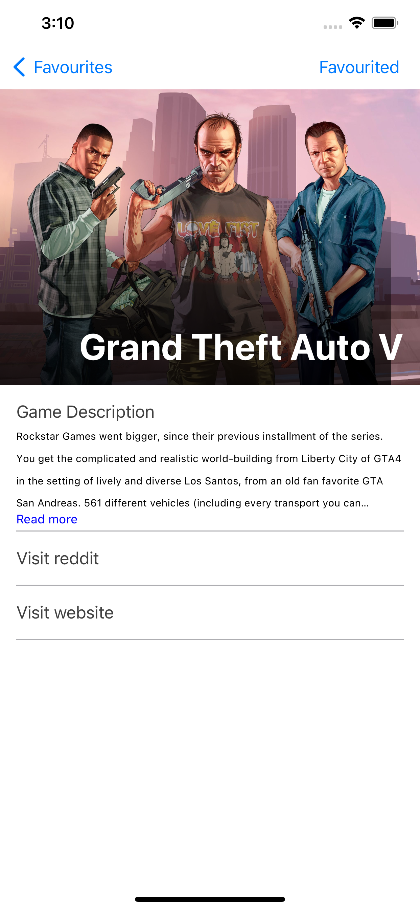

# Gaming Application

## Architectural Pattern:

I opted for the **MVVM architecture pattern** due to its benefits, including loosely coupled code, ease of writing unit tests, and a cleaner code structure compared to MVC. I did not use the coordinator pattern as there was minimal navigation required for this application. Additionally, I did not use VIPER as it would have required creating an excessive amount of classes for a relatively simple application.

## Design Pattern:

Throughout the development of the application, I made use of the **dependency injection design pattern.** This pattern allows for a more flexible and modular structure by decoupling objects and their dependencies. By using dependency injection, I was able to achieve better separation of concerns, increase testability, and make the code easier to maintain and modify. Additionally, it allows for a more flexible architecture, making it easier to change or add new components in the future, without having to make significant modifications to the existing codebase. Overall, the implementation of dependency injection was a crucial factor in ensuring the success and longevity of the application.

## Future Improvements:

Loading images asynchronously required some extra time. I believe that by caching the images and incorporating offline support, the process can be streamlined. Furthermore, incorporating additional information from the API could add valuable features to the application.

## My Favourite Part:

I enjoyed working on the entire application, but my favorite part was adding landscape support using size classes. This aspect of the project required some creative problem solving and was a fun challenge for me.

## Is ready for Appstore?

The application is functioning smoothly and is ready for submission to the app store after completing some quality assurance testing. The only remaining tasks are to add the splash images and app icons.

## Note:

This case study was beneficial in evaluating a developer's skills and abilities. By presenting a challenge, it provided an opportunity to see the actual working style and approach of the developer.

## Screenshots:

